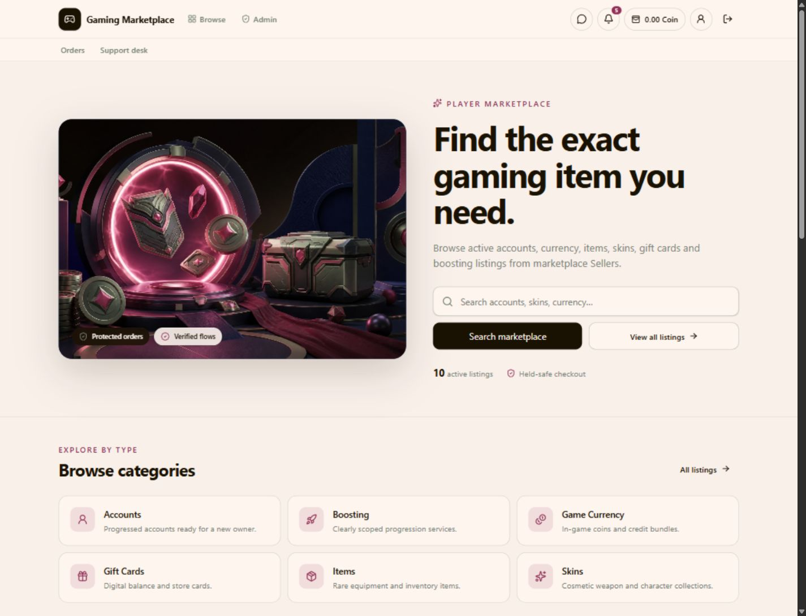

# Gaming Marketplace

A full-stack marketplace for digital gaming goods, with dedicated Buyer, Seller, and Admin experiences. Built by Muhammed and Zeyad with React, TypeScript, Fastify, and PostgreSQL.

**[Try the live demo](https://gaming-marketplace-demo.vercel.app)** · [Watch the walkthroughs](#video-walkthroughs) · [Run locally](#run-locally)



## Try before you clone

The [live demo](https://gaming-marketplace-demo.vercel.app) is a separate portfolio version designed to let you explore the experience before setting up the project locally.

- **Buyer:** try purchases, messages, support tickets, and the simulated wallet.
- **Seller and Admin:** explore the interfaces in read-only mode.
- **Your own session:** demo changes stay in your browser and do not affect other visitors. Use **Reset my demo** to start over.

**This is not how the full application normally operates.** The hosted demo uses sample data and browser-local state, with simplified role selection and restricted actions. This repository contains the full application: authentication, persistent database records, backend authorization, Seller listing management, and Admin operations. The optional inventory analyzer requires your own storage and inference service configuration.

## Video walkthroughs

These recordings show the **original application**, not the restricted hosted demo. All three videos include audio. Select a recording to open it on GitHub; use its download option if your browser does not offer inline playback.

| Walkthrough | What it shows | Recording |
| --- | --- | --- |
| Buyer POV | Shopping, orders, delivery confirmation, messaging, and support | [Watch Buyer POV · 1:19](docs/videos/buyer-pov-v1.mp4) |
| Seller POV | Listing management and the seller workflow | [Watch Seller POV · 1:24](docs/videos/seller-pov-v1.mp4) |
| Admin POV | Administration dashboard and responding to a support ticket | [Watch Admin POV · 1:22](docs/videos/admin-pov-v1.mp4) |

## Features

- **Marketplace:** categories and games, search, price filters, sorting, pagination, and listing image galleries.
- **Seller tools:** create and edit listings, manage media, activate or deactivate inventory, and handle sales and delivery.
- **Accounts and access:** Buyer, Seller, and Admin roles with backend permission checks and HttpOnly session cookies.
- **Wallet and orders:** available and held Coin balances, transaction history, simulated deposits and withdrawals, delivery confirmation, refunds, and configurable automatic order completion.
- **Communication:** direct and order-related messaging, support tickets, notifications, and reviews for completed orders.
- **Administration:** manage users, catalog entries, listings, orders, support, settings, and integrations, with audit records for administrative changes.
- **Valorant inventory analysis:** optionally upload an inventory video for an Accounts + Valorant listing, extract skin names through an external inference API, and copy a deduplicated list grouped by weapon.

Coin deposits and withdrawals are **simulations**. This project does not process real payments or bank transfers. Messaging and notifications use polling.

## Technology

| Layer | Stack |
| --- | --- |
| Frontend | React, TypeScript, Vite, Tailwind CSS, React Router, TanStack Query, Zustand |
| Backend | Node.js, TypeScript, Fastify |
| Data and jobs | PostgreSQL, Prisma, Redis, BullMQ |
| Optional video integration | Private Cloudflare R2 storage and an external inference API |
| Development | npm workspaces, Docker Compose, Vitest, ESLint, Postman |

## Run locally

### Prerequisites

- Node.js 20 or later and npm.
- Docker Desktop running with Docker Compose available.
- Git.

### Setup

```bash
git clone https://github.com/muhammedham/gaming-marketplace.git
cd gaming-marketplace
npm install
```

Copy `.env.example` to `.env`:

```powershell
# Windows PowerShell
Copy-Item .env.example .env
```

```bash
# macOS / Linux
cp .env.example .env
```

Set `JWT_SECRET` in `.env` to a random value of at least 32 characters. Keep `VITE_LISTINGS_SOURCE=api` to use the real backend. The example database settings match the included local Docker services.

```bash
npm run setup:final
npm run dev
```

`setup:final` starts PostgreSQL and Redis, applies migrations, generates Prisma Client, and seeds local accounts. `dev` starts the frontend and API together.

| Service | Local address |
| --- | --- |
| Frontend | http://127.0.0.1:5173 |
| API | http://127.0.0.1:4000 |
| Health check | http://127.0.0.1:4000/health |
| PostgreSQL | localhost:5433 |
| Redis | localhost:6380 |

### Local sample accounts

The seed creates these development accounts with empty wallets. Use the simulated deposit flow to add Coins, or run `npm run demo:final` for additional demonstration data.

| Role | Email | Password |
| --- | --- | --- |
| Buyer | `buyer@gaming.local` | `Buyer123!` |
| Seller | `seller@gaming.local` | `Seller123!` |
| Admin | `admin@gaming.local` | `Admin123!` |

These credentials are for local sample data only. Configure your own values before hosting a full installation. The public demo uses role selection instead.

### Optional Valorant video analysis

The marketplace can run without the inventory analyzer. To enable it:

1. Configure a private Cloudflare R2 bucket and the `R2_*` values in `.env`.
2. Generate a 32-byte Base64 encryption key and set `INTEGRATION_ENCRYPTION_KEY` in `.env`.
3. In **Admin → Integrations**, configure and enable the Valorant inference API URL and its optional API key.
4. Publish an Accounts + Valorant listing and use its optional video analysis page.

Videos upload directly to private R2 storage using signed URLs. MP4 and WebM are supported up to the configured 150 MB limit. Background jobs poll the provider until a terminal status is returned; there is no five-minute overall analysis cutoff. Temporary video cleanup is scheduled after two hours and requires the backend and workers to be running. Results are grouped by weapon with duplicate skin names removed.

The inference model/service is external and is not included in this repository. See the [inventory analysis integration guide](docs/api/inventory-analysis-contract.md) for configuration, endpoints, and storage requirements. Keep real credentials in `.env`; never commit them.

## Development commands

```bash
npm run dev          # Frontend and backend
npm run lint         # Lint workspaces
npm run test         # Run tests
npm run build        # Build workspaces
npm run verify       # Lint, test, and build
npm run db:deploy    # Apply existing database migrations
npm run db:generate  # Regenerate Prisma Client
npm run db:down      # Stop local Docker services
```

API integration tests require PostgreSQL and Redis. They use a separate test schema and isolated job fixtures. On Windows, stop the API before regenerating Prisma Client if an `EPERM` file-lock error occurs.

## Project structure

```text
apps/
  web/                 React frontend
  api/
    prisma/            Database schema, migrations, and seed
    src/modules/       API features and background jobs
docs/                  API contracts, architecture, and walkthrough videos
demo-assets/           Sample marketplace artwork
uploads/               Local uploaded media (excluded from Git)
```

## Documentation

- [Architecture](docs/architecture/README.md)
- [Authentication](docs/api/auth-contract.md)
- [Listings and media](docs/api/listings-contract.md)
- [Wallet](docs/api/wallet-contract.md)
- [Orders, messaging, and support](docs/api/orders-support-contract.md)
- [Administration](docs/api/admin-contract.md)
- [Inventory analysis](docs/api/inventory-analysis-contract.md)
- [Postman collections](docs/postman)
- [Known limitations](docs/final/known-medium.md)

The linked engineering documents include the project's original Turkish documentation.
