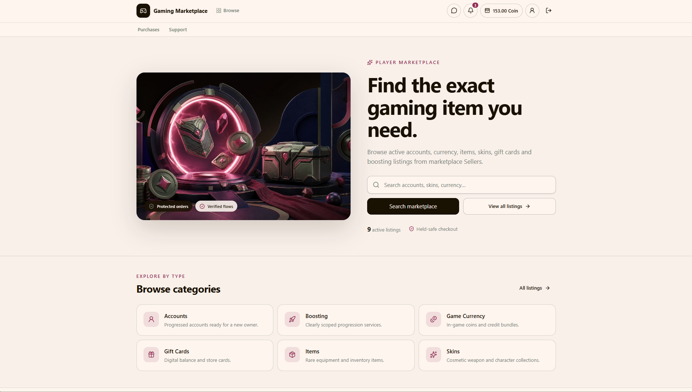

# Gaming Marketplace

An independent marketplace MVP where players can list and purchase digital gaming goods. Mercur was used only as a reference for marketplace flows; its code is not included in this repository.

## Live Demo and Walkthroughs

**[Try Gaming Marketplace](https://gaming-marketplace-demo.vercel.app)** before cloning and setting up the project.

The hosted demo uses sample data: Buyer actions are saved only in your browser, while Seller and Admin are read-only. This simplified setup is for visitors to try the user experience. The original application in this repository uses real authentication, a backend and database, and full Seller/Admin workflows.



The following videos include audio and show the **original application**, not the restricted demo.

### Buyer POV

https://github.com/user-attachments/assets/df7ea98c-ab7f-40d2-b211-d1086fd0ca34

### Seller POV

https://github.com/user-attachments/assets/671b2478-c4a2-4720-a06f-3343cbcd4a10

### Admin POV

https://github.com/user-attachments/assets/752e2758-efa5-45fe-a6fa-6be5bac9f42a

## Team and Timeline

- Muhammed — Full-Stack Developer
- Zeyad — Full-Stack Developer
- Project start: August 12, 2026
- Final sprint delivery: September 5, 2026

## Technology Stack

- Web: React, TypeScript, Vite, Tailwind CSS, React Router, TanStack Query, Zustand
- API: Node.js, TypeScript, Fastify
- Data: Prisma ORM, PostgreSQL, Redis
- Background jobs: BullMQ
- Tools: npm workspaces, Docker Compose, Vitest, Postman

## Project Structure

```text
gaming-marketplace/
|-- apps/
|   |-- web/                 React + Vite
|   `-- api/                 Fastify + Prisma
|       |-- prisma/          Schema, migrations, and seed
|       `-- src/modules/     API feature modules and workers
|-- docs/                    Architecture and API documentation
|-- uploads/                 Local media (excluded from Git)
|-- docker-compose.yml
|-- .env.example
`-- package.json
```

## Initial Setup

Requirements: Node.js 20 or later, npm, Git, and Docker Desktop running.

Clone the repository, then run the following in PowerShell:

```powershell
git clone https://github.com/muhammedham/gaming-marketplace.git
cd gaming-marketplace
Copy-Item .env.example .env
npm install
npm run setup:final
npm run dev
```

On macOS/Linux, use `cp .env.example .env` instead of `Copy-Item`.

`setup:final` starts PostgreSQL and Redis, applies migrations, generates Prisma Client, and seeds the database. `dev` starts both development servers; use `dev:web` and `dev:api` to run them separately.

Set your own `JWT_SECRET` in `.env` (at least 32 characters). Keep `VITE_LISTINGS_SOURCE=api` for the real Fastify backend. The optional R2/inference integration can be configured later.

## Local Addresses

| Service | Address |
| --- | --- |
| Web | http://127.0.0.1:5173 |
| API | http://127.0.0.1:4000 |
| Health check | http://127.0.0.1:4000/health |
| PostgreSQL | localhost:5433 |
| Redis | localhost:6380 |

## Demo Accounts

`npm run db:seed` creates these local development accounts and a zero-balance wallet for each. Deposits and withdrawals are simulation-only.

| Role | Email | Password |
| --- | --- | --- |
| Admin | `admin@gaming.local` | `Admin123!` |
| Buyer | `buyer@gaming.local` | `Buyer123!` |
| Seller | `seller@gaming.local` | `Seller123!` |

These are sample credentials for local development. Configure your own credentials before hosting a full installation.

## Sprint 1 — Authentication

- Registration supports Buyer and Seller roles; user and wallet creation are atomic.
- Login stores the session JWT in an HttpOnly cookie.
- Backend authorization protects role-specific actions; logout clears the session.

[Auth API contract](docs/api/auth-contract.md)

## Sprint 2 — Categories, Games, Listings, and Media

- Search and filter active listings by category, game, price, and sorting, with pagination.
- Sellers create listings with a cover image, manage galleries/videos, edit details, and activate or deactivate their own inventory.
- The backend validates ownership, media type, file signature, size, and upload limits.

[Listings API contract](docs/api/listings-contract.md)

## Sprint 3 — Wallet and Coin Simulation

- Available and held balances, deposit/withdrawal simulation, fee preview, and paginated history.
- Balance changes and append-only ledger entries are recorded in the same database transaction.
- Withdrawals store masked IBAN information. No real payments or bank transfers are processed.

[Wallet API contract](docs/api/wallet-contract.md)

## Sprint 4 — Orders, 24-Hour Confirmation, and Communication

- Purchases hold Buyer Coins until confirmation releases them to the Seller; refunds return them to the Buyer.
- Delivery notes, order timelines, confirmation, and default 24-hour automatic completion are supported by background jobs.
- Support can pause and resume order resolution or complete/refund an order.
- Text messaging, notifications, seller profiles, and completed-order reviews are included. Communication uses polling.

[Orders and support API contract](docs/api/orders-support-contract.md) · [Sprint 4 documentation](docs/sprint-4/README.md)

## Sprint 5 — Admin, Integration, and Final Delivery

- Admin dashboard and management screens cover users, catalog, listings, orders, withdrawals, support, and settings.
- Administrative changes create audit records. The last active Admin cannot be removed.
- Settings control the Coin conversion rate, withdrawal fee, and automatic confirmation period for new deliveries.

`npm run demo:final` prepares additional demonstration records, including a completed order with a review and a paused support order.

[Admin API contract](docs/api/admin-contract.md) · [Sprint 5 documentation](docs/sprint-5/README.md) · [Known limitations](docs/final/known-medium.md)

## Valorant Inventory Video Analyzer

- Optional analysis for `Accounts + Valorant` listings, with MP4/WebM uploads up to the configured 150 MB limit.
- Videos upload directly to private Cloudflare R2 storage using signed URLs.
- Background jobs poll the external inference API until a terminal status is returned.
- The UI collects detections across frames, removes duplicates, and groups skin names by weapon for copying.
- Temporary video cleanup is scheduled after two hours and requires the backend workers to be running.
- Admin manages the API URL and optional encrypted API key under Integrations. R2 credentials and the encryption key stay in `.env`.

The external model/service is not included. [Inventory analysis integration guide](docs/api/inventory-analysis-contract.md)

## Database Commands

```powershell
npm run db:up        # Start PostgreSQL and Redis
npm run db:deploy    # Apply existing migrations
npm run db:seed      # Create/update local sample accounts
npm run db:migrate   # Create migrations during development
npm run db:generate  # Regenerate Prisma Client
npm run db:down      # Stop Docker services
```

On Windows, stop the API before regenerating Prisma Client if an `EPERM` file-lock error occurs.

## Quality Checks

```powershell
npm run lint
npm run test
npm run build
npm run verify       # Lint, tests, and builds
```

API integration tests require PostgreSQL and Redis and use a separate test schema. [Postman collections](docs/postman) and detailed API contracts are included in `docs/`; the original engineering documentation includes Turkish text.
